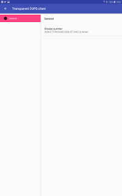

# android-intent-cups-client

Print from android jpeg intent filter to network cups printers

This is **not** an android print service. Instead, this application
answers to the *jpeg* intent filter and send file to a preselected network 
**CUPS** printer.

# Screenshots

